# SpringBoot Vue房屋租赁系统
基于SpringBoot Vue房屋租赁系统
[详细说明](https://liuyanzhao.com/shop/verio-vue.html)  

#### 演示地址：
  前台页面 http://verio-portal.liuyanzhao.com  
  后台管理 http://verio-manage.liuyanzhao.com  
  测试账号：管理员admin、租客zhangsan、房东mayun，密码都是123456  
  
####  演示视频：
演示视频1：B站地址：https://www.bilibili.com/video/BV13W4y1P7cq   
演示视频2：https://pan.baidu.com/s/1iRVLazwr0nLJlcSdcLMDkw?pwd=5aiq   
完成时间：2024年1月20日  

## 功能组成
- 主要功能模块
- 1、用户注册和登录（可注册房东或租客；管理员不许注册）
- 2、房屋管理 (房东或管理员特有功能)
- 3、订单管理（创建订单、签订合同、支付订单、查看订单）
- 4、账单管理
- 5、报修管理（租客发布，房东处理）
- 6、反馈管理（租客或房东发布，管理员处理）
- 7、房屋收藏管理
- 8、文章管理 （可发“我要招租”或“我要求租”类文章）
- 9、文章评论管理（查询自己发布或收到的评论）
- 10、新闻资讯管理 (管理员特有功能)
- 11、用户管理 (管理员特有功能)

## 技术组成
- SpringBoot
- MyBatis Plus
- VueJS + ElementUI
- MySQL
- Maven

## 预览
1-首页-1.png

1-首页-2.png
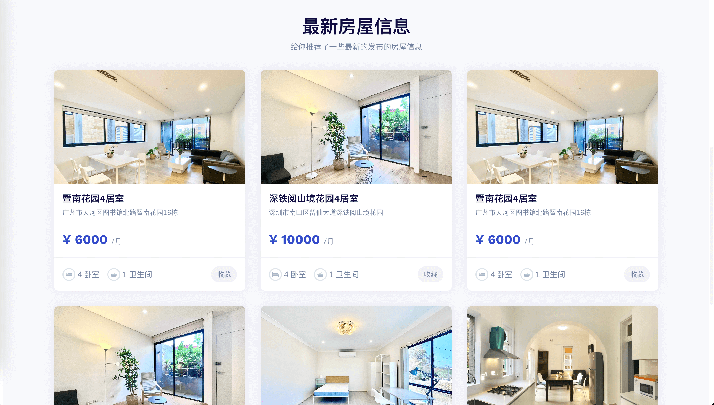
3-房源列表.png
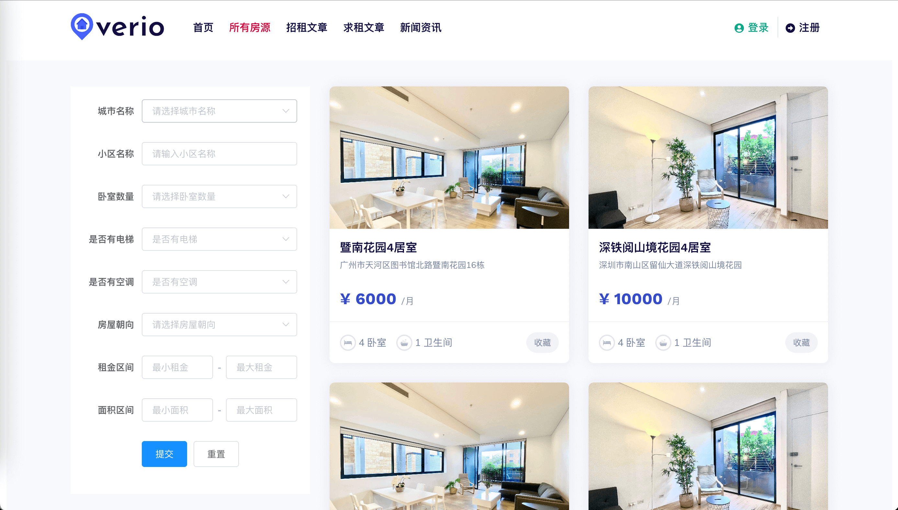
4-文章列表.png
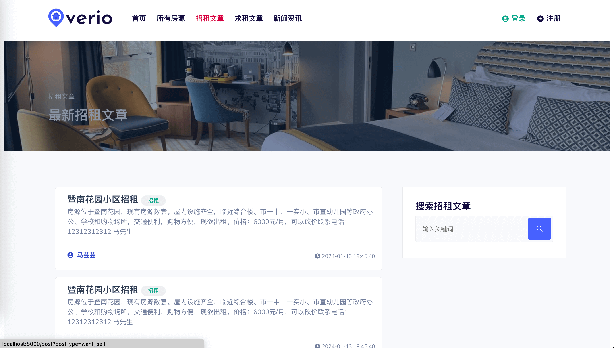
5-新闻列表.png
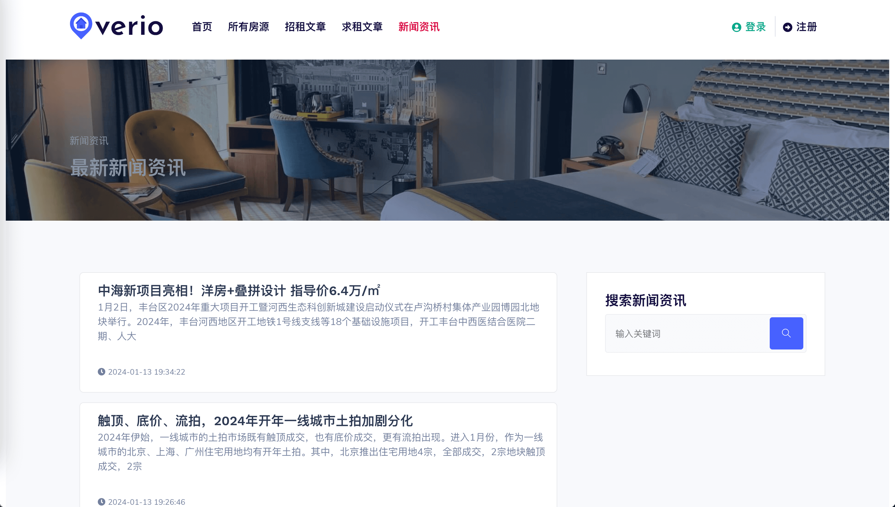
6-房子详情-1.png
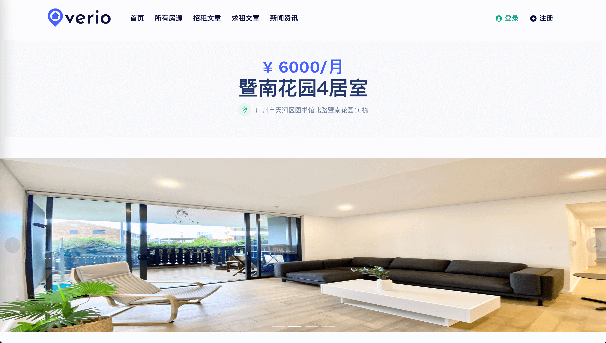
7-房子详情-2.png

8-文章详情.png
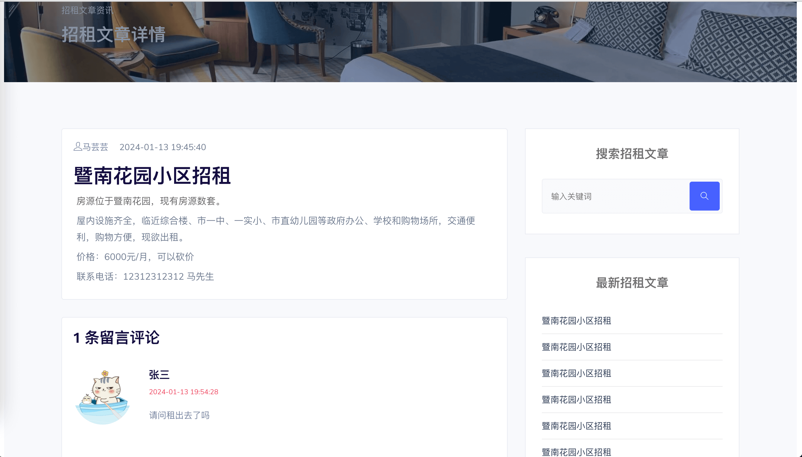
9-新闻详情.png
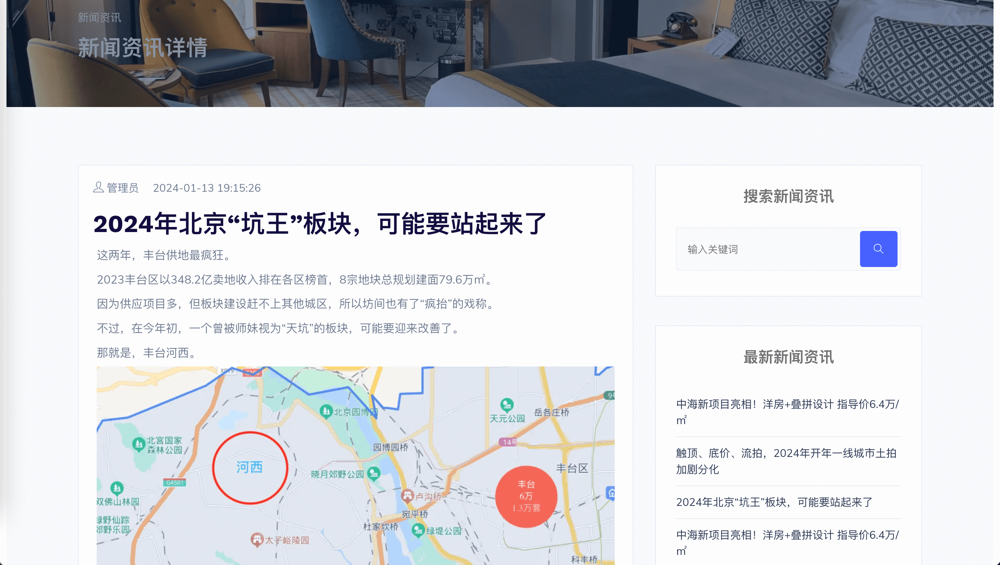
10-登录.png

11-注册.png

12-房屋管理.png

13-房屋创建和编辑.png
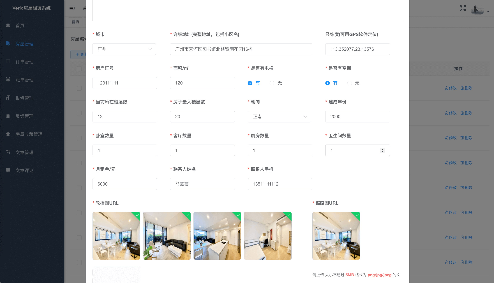
14-创建订单签订合同.png
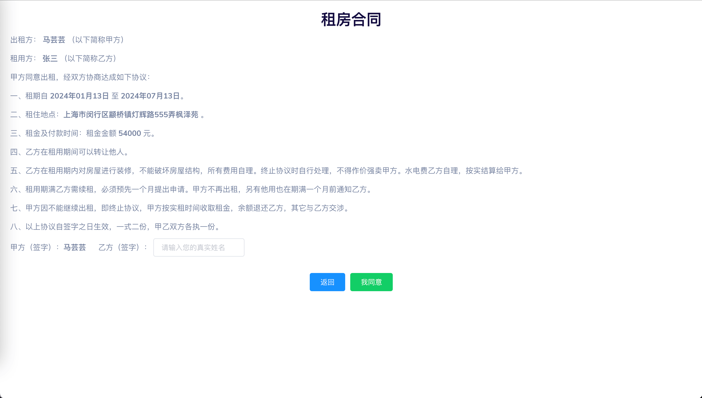
15-创建订单支付.png

16-订单详情.png

17-订单管理.png
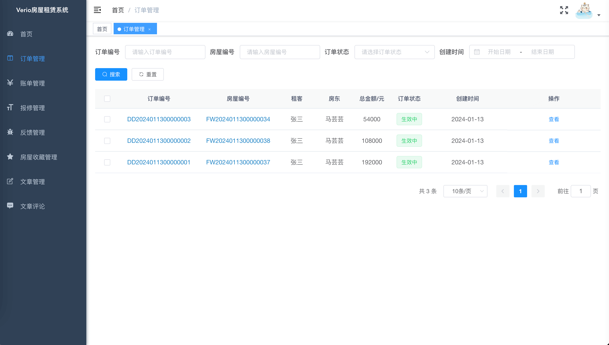
18-账单管理.png
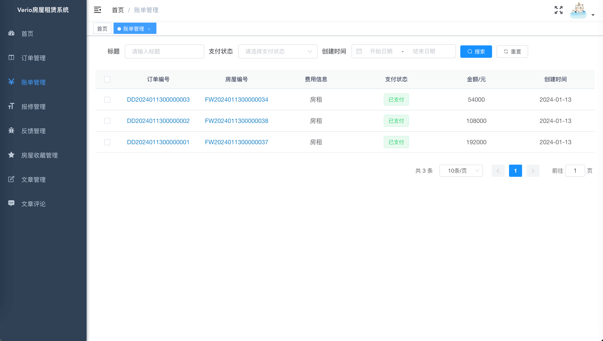
19-报修管理.png
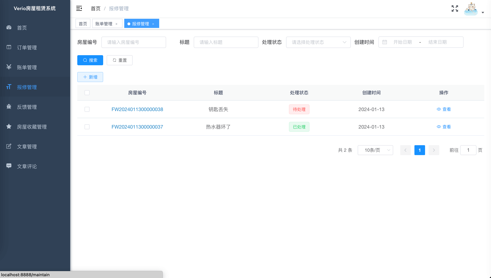
20-反馈管理.png

21-收藏管理.png

22-文章管理.png

23-文章评论.png
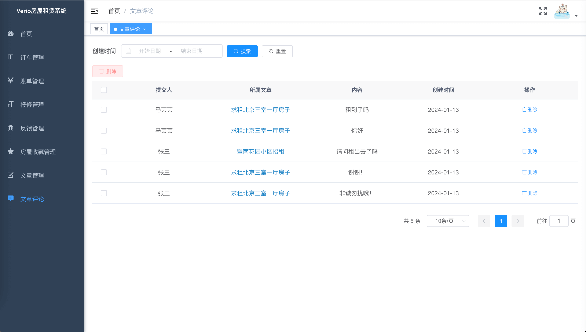
24-个人信息.png
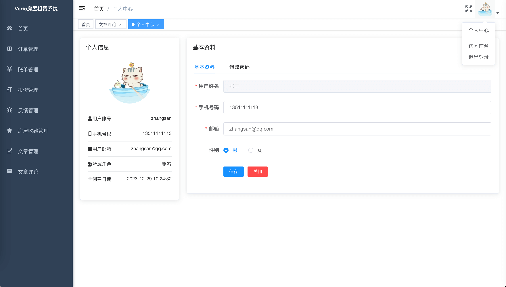
25-新闻资讯管理.png
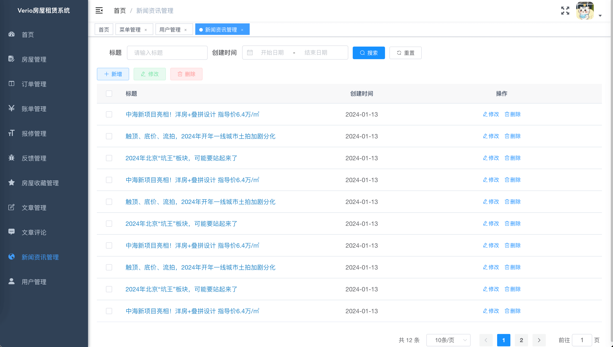
26-用户管理.png

## 联系方式
该项目可用于房租租赁系统前期使用或二次开发铺垫，毕设等。  
长期更新！大家可以提需求，我可以及时更新！   
支持定制，加功能，减功能   
需要完整代码，联系本人，提供源码，远程部署和问题解答  
微信：847064370   
